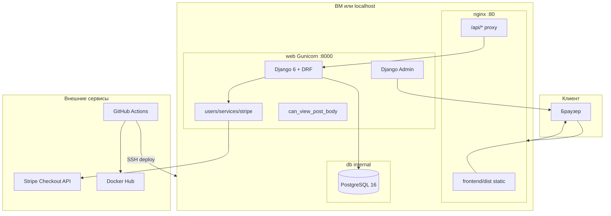
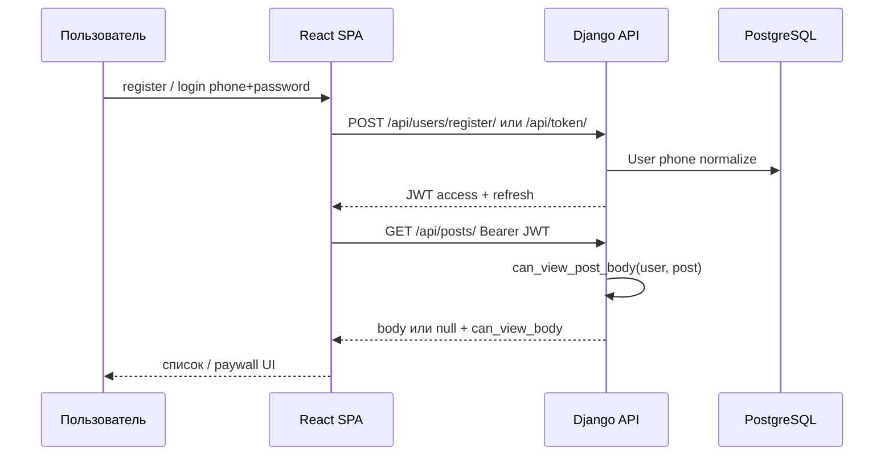
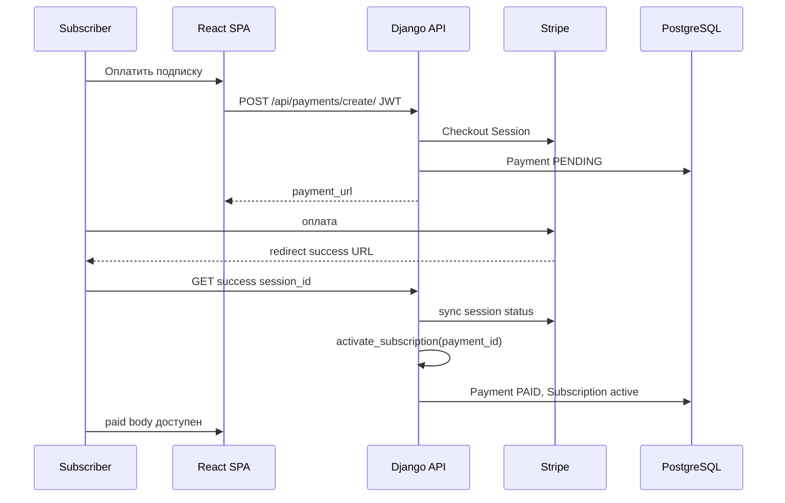
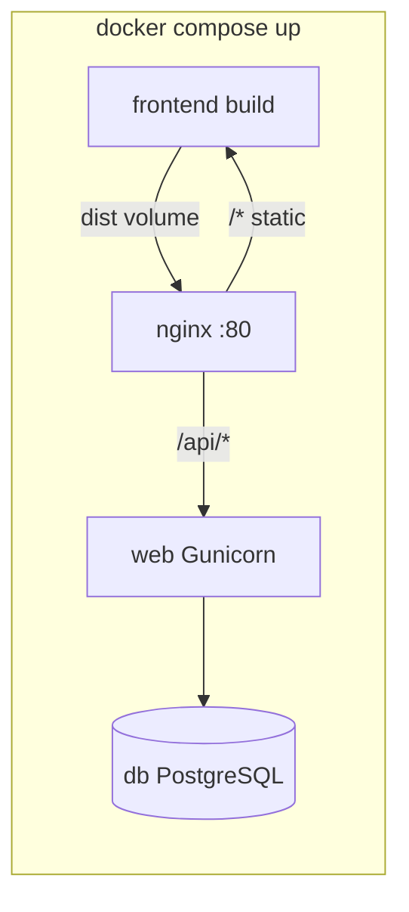
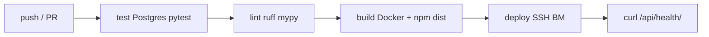

# OB2 — Платформа для публикации платного контента

Дипломный проект SkyPro (**Fullstack**).

**Кратко:** авторы публикуют записи (free/paid); гости видят бесплатные материалы; платные — после
регистрации по телефону и разовой оплаты подписки через Stripe.

**ТЗ:** [ob2-tEc234qeKK](https://skypro.yonote.ru/share/ce519023-e64c-4c31-bfcf-e463e0fb577d/doc/ob2-tEc234qeKK)

**Теги OB2:** Auth, Django, Docker, Docker-Compose, Forms, Git, JWT, ORM, PEP8,
PostgreSQL, Readme, Templates, Сторонние API

**План и декомпозиция:** [ПЛАН-ПРОЕКТА.md](ПЛАН-ПРОЕКТА.md)

---

## Что должно получиться в конце (целевая картина)

Готовый проект — **монорепозиторий**: Django JSON API + React SPA + PostgreSQL в Docker,
деплой на ВМ через GitHub Actions.

### Для пользователя (браузер)

| Роль | Что видит |
|------|-----------|
| **Guest** | Список постов: title всех; body free; у paid — paywall |
| **User (без подписки)** | CRUD своих постов; paid body скрыт |
| **Subscriber** | Полный body всех paid-постов + оплата уже пройдена |
| **Автор** | Свои paid-посты видит всегда (даже без подписки) |

### Для проверяющего / защиты

| URL / артеfact | Назначение |
|----------------|------------|
| `http://<host>/` | React SPA — основной UI |
| `http://<host>/api/health/` | Health check (prod / CI) |
| `http://<host>/api/docs/` | OpenAPI (только `DEBUG=True`) |
| `http://<host>/admin/` | Django admin — **Forms** + **Templates** (теги OB2) |
| `docker compose up --build` | Локально поднимает db + web + nginx + SPA |
| GitHub Actions | test → lint → build → deploy на ВМ |
| `pytest --cov-fail-under=85` | Покрытие ≥ 85 % |

### Demo-сценарий (сквозной)

1. Guest открывает SPA → видит free-посты целиком, paid — без body.
2. Register по телефону → JWT → login в SPA.
3. «Оплатить подписку» → Stripe Checkout → success → `activate_subscription()`.
4. Subscriber открывает paid-пост → body доступен.
5. На защите: `/admin/` — редактирование Post через Django Form.

---

## Схема архитектуры (prod / Docker Compose)



---

## Поток данных: авторизация и доступ



---

## Поток оплаты (v1, sync Stripe)



---

## Стек технологий

### Backend

| Слой | Технология |
|------|------------|
| Язык | Python 3.14+ |
| Фреймворк | Django 6 |
| API | Django REST Framework |
| Auth API | djangorestframework-simplejwt (JWT) |
| Auth admin | Django session |
| CORS | django-cors-headers |
| API docs (dev) | drf-yasg |
| ORM / БД | Django ORM → PostgreSQL 16 |
| Оплата | Stripe Checkout (сторонний API) |
| Статика API | WhiteNoise + collectstatic |
| WSGI | Gunicorn |
| Зависимости | Poetry |
| Качество | Ruff (PEP8, 119), mypy, pytest-cov ≥ 85 % |

### Frontend

| Слой | Технология |
|------|------------|
| UI | React 19 + TypeScript |
| Сборка | Vite |
| Стили | Bootstrap 5 (или UI-kit) |
| HTTP | fetch/axios + JWT attach + refresh |
| Prod | `frontend/dist/` → nginx |

### Инфраструктура

| Слой | Технология |
|------|------------|
| Контейнеры | Docker |
| Оркестрация | Docker Compose (db, web, frontend build, nginx) |
| Reverse proxy | nginx (SPA + `/api/` + rate limit auth) |
| CI/CD | GitHub Actions: test → lint → build → deploy |
| Образ prod | Docker Hub + `docker-compose.hub.yml` |
| Секреты | `.env` на сервере; GitHub Secrets для CI |
| **v2 опц.** | Celery + Redis + Stripe webhook |

### Соответствие тегам OB2

| Тег | Реализация |
|-----|------------|
| Auth | register/login phone; JWT; admin session |
| Django | apps `users`, `posts`, `config` |
| Docker / Docker-Compose | `Dockerfile`, `docker-compose.yml` |
| Forms | `users/forms.py`, `posts/forms.py` в admin + StyleFormMixin |
| Git | GitHub remote |
| JWT | `/api/token/`, refresh |
| ORM | модели без raw SQL |
| PEP8 | Ruff |
| PostgreSQL | сервис `db` в Compose |
| Readme | этот файл |
| Templates | `templates/admin/`, `templates/payments/` |
| Сторонние API | Stripe |

---

## Структура репозитория (целевая)

```
ob2-paid-content/
├── config/              # settings, urls, constants, form_mixins
├── users/               # User(phone), Payment, Subscription, stripe service
├── posts/               # Post, serializers, permissions, access
├── frontend/            # React SPA (src/, dist/)
├── templates/           # admin/, payments/ — тег Templates
├── deploy/nginx/        # ob2.conf
├── scripts/             # entrypoint.sh, deploy-remote.sh
├── tests/               # pytest + security
├── wiki/                # ci-cd, frontend, servers (после ит. 7)
├── .github/workflows/   # ci-cd.yml
├── docker-compose.yml
├── Dockerfile
├── pyproject.toml
├── .env.example
├── ПЛАН-ПРОЕКТА.md
└── README.md
```

---

## Docker Compose (что поднимается)



| Сервис | Порт наружу | Роль |
|--------|-------------|------|
| `db` | internal | PostgreSQL, volume |
| `web` | internal | migrate, collectstatic, Gunicorn |
| `frontend` | — | одноразовая сборка → `dist/` |
| `nginx` | **80** | SPA + proxy API |

Проверка после `up`:

```bash
curl -s http://localhost/api/health/
```

---

## CI/CD (конечный pipeline)



| Job | Действие |
|-----|----------|
| **test** | poetry install, migrate, pytest |
| **lint** | ruff check/format, mypy |
| **build** | docker push Hub; artifact `frontend-dist` |
| **deploy** | rsync + dist; compose pull; up на ВМ |

---

## Матрица доступа к контенту

| Действие | Guest | User | Subscriber | Автор своего paid |
|----------|-------|------|------------|-------------------|
| Список title | да | да | да | да |
| body free | да | да | да | да |
| body paid | нет | нет | да | да |
| CRUD постов | нет | свои | свои | свои |

Единая логика в коде: `can_view_post_body()` → serializer → SPA только отображает.

---

## Локальный запуск

### Backend (Poetry + Postgres в Docker)

```bash
cp .env.example .env
docker compose up db -d --wait
poetry install
poetry run python manage.py migrate
poetry run python manage.py runserver
# API: http://127.0.0.1:8000/api/health/
# .env: DB_HOST=localhost, DB_PORT=5433 (5433→5432 в контейнере db)
```

### SPA (dev)

```bash
cd frontend
npm install
npm run dev
# UI: http://localhost:5173 (proxy /api → runserver)
```

### Полный стек (Docker Compose)

```bash
cp .env.example .env
docker compose config
docker compose up --build
curl -s http://localhost/api/health/
# SPA: http://localhost/
# web в Compose подключается к db по internal network (DB_HOST=db)
```

Переменные — [.env.example](.env.example), prod-шаблон — [.env.production.example](.env.production.example).

---

## REST API (основные endpoints)

| Метод | URL | Auth | Описание |
|-------|-----|------|----------|
| GET | `/api/health/` | — | Health check |
| POST | `/api/users/register/` | — | Регистрация `{phone, password}` |
| POST | `/api/token/` | — | JWT `{phone, password}` |
| POST | `/api/token/refresh/` | — | Обновление access |
| GET | `/api/users/me/` | JWT | Профиль + `subscription_active` |
| GET | `/api/posts/` | — | Список (paywall в serializer) |
| GET | `/api/posts/{id}/` | — | Деталь поста |
| POST/PATCH/DELETE | `/api/posts/` | JWT | CRUD своих постов |
| POST | `/api/payments/create/` | JWT | Stripe Checkout URL |
| GET | `/api/payments/success/?session_id=` | JWT | Sync оплаты + activate |
| GET | `/api/payments/{id}/` | JWT | Статус своего платежа |

OpenAPI: `/api/docs/` при `DEBUG=True`.

---

## Demo-сценарий (локально)

1. `docker compose up db -d --wait` + `poetry run python manage.py runserver`
2. `cd frontend && npm run dev` → http://localhost:5173
3. Guest: главная — free body виден, paid — «Текст скрыт»
4. Регистрация → профиль → «Оплатить подписку» (нужны Stripe test keys в `.env`)
5. После success (`/payment/success?session_id=...`) — paid body в API
6. `/admin/` — редактирование Post через Django Form (теги Forms/Templates)

Подробнее — [COVERAGE.md](COVERAGE.md), [ПЛАН-ПРОЕКТА.md](ПЛАН-ПРОЕКТА.md).

---

## Качество и безопасность

| Требование | Инструмент / правило |
|------------|---------------------|
| PEP8 | `poetry run ruff check .` |
| Типизация | `poetry run mypy .` |
| Тесты ≥ 85 % | `poetry run pytest` |
| Production | `manage.py check --deploy` |
| Секреты | только `.env`, не в Git |
| IDOR | чужой Post/Payment → 404 |
| Paid leak | body только через `can_view_post_body` |

---

## Статус разработки

| Итерация | Содержание | Статус |
|----------|------------|--------|
| 0 | Poetry, Django каркас, план | готово |
| 1 | Docker, nginx, SPA build | готово |
| 2 | Users, JWT, CORS, forms admin | готово |
| 3 | Posts API, paywall | готово |
| 4 | Stripe sync, подписка | готово |
| 5 | React SPA | готово |
| 6 | Coverage ≥85 %, security tests | готово |
| 7 | CI/CD, деплой на ВМ | — |

Подробная декомпозиция — [ПЛАН-ПРОЕКТА.md](ПЛАН-ПРОЕКТА.md).
